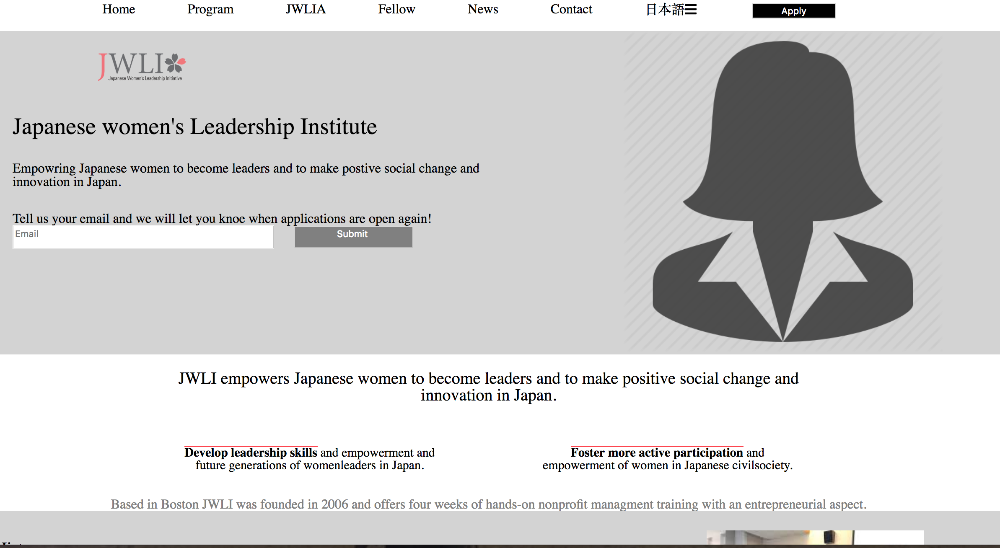

# JWLI PROJECT
I built a client website that empowers Japanese women to become leaders and to make positive social change and innovation in Japan.

## How It's Made:
Used a html and css to display content and style a clean website. Used media queries to ensure responsiveness across three platforms.

**Tech used:** HTML, CSS and Media queries

## Optimizations
I would add javascript to give the site behaviors and make it functional.

## Lessons Learned:

I learned how to build a website without using any templates and utilizing css to style the page.
# JWLI-mock-site
